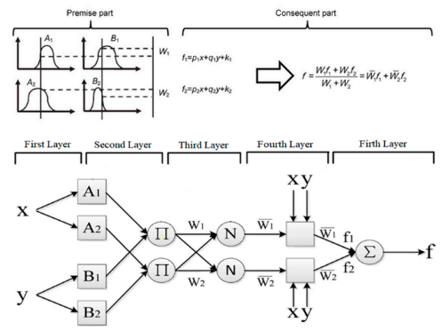
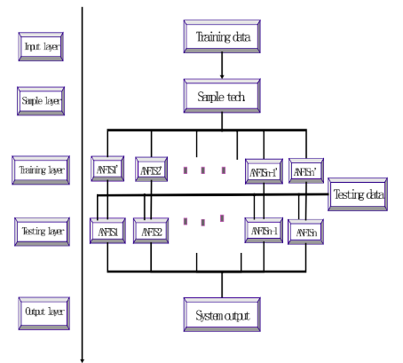
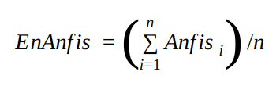
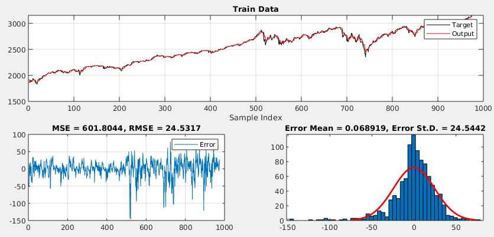
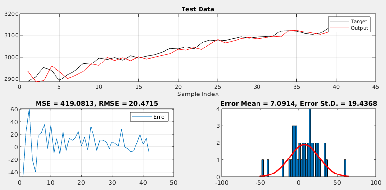
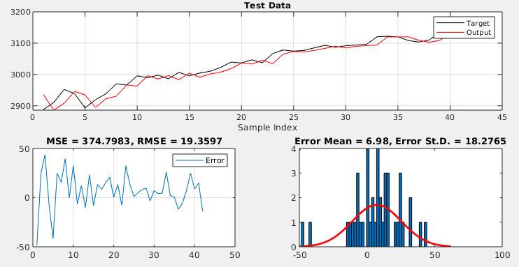

# An ANFIS Model for Stock Price Prediction

| Problem	| Methods	| Libs	|
| ---       | ---       | ---   |
| Stock Price Prediction (regression)| Fuzzy Logic, ANFIS, time series, ensemble learning | `anfis`, `genfis`, `matlab` |

## Contents

- [Abstract](#abstract)
- [Keywords](#keywords)
- [Introduction](#introduction)
- [Literature Review](#literature-review)
- [Methodology](#methodology)
  * [Data Preparation](#data-preparation)
  * [Creation of Train and Test Datasets](#creation-of-train-and-test-datasets)
  * [Building the FIS Models](#building-the-fis-models)
  * [Generating the ANFIS Models](#generating-the-anfis-models)
  * [Constructing the Ensemble ANFIS Model](#constructing-the-ensemble-anfis-model)
- [Experiments and Results](#experiments-and-results)
- [Discussion and Conclusion](#discussion-and-conclusion)
- [References](#references)

## Abstract

The prediction of stock prices has always been an attractive studying area that many people are interested in. We constructed Adaptive Neuro-Fuzzy Inference System (ANFIS) models using three different methods and compared their results. An ensemble model is built by taking the average of the tuned models. Even though there are similar applications in the literature, it was a real challenge to reach minimum error values while the data set does not have any seasonality but sharp rises and dicreasements.

Grid partitioning, subtractive clustering and fuzzy c-means clustering methods are applied in this study. The experiments that we conducted was aimed to compare performance between different methods we benefitted while building our ANFIS models. The metrics of R-squared and mean standard error are mainly taken into account while interpreting the results. R-squared values greater than .90 are obtained in the experiments.

## Keywords

_Adaptive network-based fuzzy inference system (ANFIS), Stock Forecasting, Stock price prediction, Time Series Regression, SNP 500_

## Introduction

The prediction of stock prices has always been an attractive studying area that many people are interested in as it has the ability to directly increase the chance of profiting for the financial interpreters. In this study, we worked on the problem of predicting the next days’ closing price of SNP 500 index.

Many traditional time series models have been proposed and applied to economic forecasting. Recent advances in soft computing techniques provide suitable tools to predict chaotic environments as in our problem: stock market closing prices. Therefore, we constructed Adaptive Neuro-Fuzzy Inference System (ANFIS) models using three different methods with two different datasets and compared their results.

Although neuro-fuzzy systems have the advantages of faster convergence, higher accuracy of prediction, and needless to make any assumptions about the statistical properties of data; defining their structures is not a simple task.

The rest of this paper has been organized as follows:

The next section provides the relevant studies. Methodology section reviews the overall structure and learning procedure of ANFIS. The utilized performance measures for evaluating our model are described and the structure of the proposed model is defined in this section as well. Experiments and Results section contains a comparison of the results of the implemented models. Finally, some concluding remarks are pointed out in the Discussion and Conclusion section.

## Literature Review

Prediction of stock prices in an exchange market is an ongoing research area. There are several studies in the fields of finance, mathematics, statistics, machine learning and deep learning. 

Most famous classical method to predict the future values of stock prices is by using time series analysis. Engle (Engle, 1982) developed the ARCH (autoregressive conditional heteroscedasticity) model, which has been used by many financial analysts.The GARCH (Bollerslev, 1986) (generalized ARCH) model is the generalized form of ARCH and has wider use. Box and Jenkins (Box, 2013) established the autoregressive moving average (ARMA) model, which combines a moving average with a linear difference equation and makes forecasts under linear stationary conditions. The improved version, again proposed by Box is the  autoregressive integrated moving average model (ARIMA) (Box, 2013) , with the assumption of linearity between variables, was proposed to handle non-stationary behavior datasets. All these statistical methods overlook the effects of other factors and model the price as a series, the value change is implied only by passing of time. 

Another classical well-known approach to predict the stock prices is the “efficient market hypothesis” and “the random walk”. Markiel proposes that stock prices cannot be precisely predicted using the historical price data (Malkiel, 2003). He claims that the average market return beats the return of most portfolios managed by professionals. 

On the other hand, recent studies focus on the use of artificial intelligence and machine learning; deploying methods such as artificial neural networks or genetic algorithms. Deployment of ensemble models, which combine the outputs of different machine learning algorithms, is also a common approach in machine learning. 

In 1965, Zadeh proposed the concept of Fuzzy Sets (Zadeh, 1965). In the fuzzy set logic, there are no strict/well-defined boundaries. On top of Fuzzy Sets, Takagi and Surgeno (Takagi & Sugeno, 1993) were the first researchers to systematically explore fuzzy modelling or fuzzy identification. Their work has found numerous practical applications in control, prediction and inference. 

Adaptive neuro fuzzy inference system (ANFIS) is a hybrid technique that integrates the advantage of learning in an ANN and using a set of fuzzy if-then rules with appropriate membership functions to generate input-output pairs with a high degree of accuracy (Jang, 1993); which is built on top of Fuzzy Sets and Fuzzy Modelling. ANFIS is a powerful tool for prediction, and this method has applications in prediction of stock prices. 

In 2010, the authors of (Boyacioglu & Avci, 2010) used monthly return data from January 1990 to December 2008, collected from the Central Bank of the Republic of Turkey (CBRT) Electronic Data Delivery System and Matriks Information Delivery Services Inc. Their main focus is predicting the market returns of İstanbul stock exchange. The study shows that the training accuracy improves by decreasing the number of input membership functions, two gauss input membership function (Gbell) seems to be the best-resulting model for the data set used.

In 2013, (Svalina, Galzina, Lujić, & Šimunović, 2013) proposed an ANFIS model in order to predict the closing prices of the following 5-days’ Zagreb Stock Exchange Crobex  index. They retrieved the closing prices from 4 November 2010 to 24 January 2012 from Zagreb Stock Exchange official internet pages. They reported the values of average relative error (AvRE), average coefficient of variation of root square mean error AvCV(RSME) and the ratio of the sums of the actual close price and the predicted close price. They report that, for any of the prediction days the average relative error is less than 1.5% and the average coefficient of variation of root square mean error is less than 2.5%. They conclude that the proposed model is most useful in forecasting whether the index close price would increase or decrease. 

In 2015, the authors of (Billah, Waheed, & Hanifa, 2015) tried to find out an efficient soft computing technique for Dhaka Stock Exchange (DSE) closing price prediction. They compared ANN with ANFIS and used the data of five largest companies, over the period from January 2013 to April 2015. Their results show that ANFIS has less error(RMSE) than ANN and higher R2 value indicating strong correlation with output. 

In (Melin, Soto, Castillo, & Soria, 2012), the authors set up an ensemble ANFIS model to predict chaotic time series of Mackey and Glass, Mackey and Mackey-Glass, the Dow Jones Company, Dow Jones Indexes and Mexican exchange stock. They create three different membership functions for each approximation and combine the outputs. Combination methods are integrator by average and the integrator by weighted average. They report that the performance obtained with this architecture overcomes several standard statistical approaches and neural network models reported in the literature by various researchers. They achieved 98% of accuracy with the Mackey–Glass time series, 97% accuracy with the Dow Jones time series, and 99% accuracy with the Mexican exchange stock time series. 

In the literature, some hybrid techniques are proposed to improve the performance of ANFIS. 

In (Esfahanipour & Mardani, 2011), the authors synthesized an ANFIS model with fuzzy subtractive clustering aimed at some dimensionality reduction to construct a first order TSK fuzzy inference system with the minimum number of rules. They applied the hybrid model on Tehran Stock Exchange Price Index (TEPIX) from 25 March 2001 until 25 September 2010. The results obtained were compared with the best obtained results of ANFIS with no clustering, ANFIS with FCM clustering and Multi Layer Perceptron with Levenberg Marquardt training algorithm. The utilized performance measures suggest higher forecasting accuracy of the proposed model in comparison with the best results of the compared algorithms. 

In (Wei, 2016), the author proposes a novel ANFIS method and a simple approach for making stable predictions of fluctuating data. Taiwan Stock Exchange Capitalization Weighted Stock Index (TAIEX) and Hang Seng Stock Index (HSI) data are used from 2000 to 2006 and from 2000 to 2004 respectively. First, this approach uses EMD to decompose the original stock index (t) data into IMFs (intrinsic mode functions) and a residue (R). Then, the tendencies of these IMFs and the residue are modeled and forecasted using ANFIS, which can overcome the limitations of statistical methods. Finally, the prediction results are integrated to obtain a final forecasting value. By use of this algorithm, the author tries to overcome the three major drawbacks of using time series methods for the stock market: 
 (1) some models can not be applied to datasets that do not follow statistical assumptions; 
 (2) most time series models that use stock data with a significant amount of noise involutedly (caused by changes in market conditions and environments) have worse forecasting performance; and 
 (3) the rules that are mined from artificial neural networks (ANNs) are not easily understandable. 
 They conclude that proposed model is superior to the other methods in terms of RMSE the proposed model performs better than the ANFIS model. 

In (Sedighi, Jahangirnia, Gharakhani, & Fard, 2019), the authors propose another hybrid model for stock price forecasting of 50 largest American companies in the stock market. First, ABC (Artificial Bee Colony) is used for optimizing the technical indicators for forecasting instruments. Then, ANFIS is used for predicting long-run price fluctuations of the stocks and forecast more precisely. Lastly, SVM (Support Vector Machine) is used as a preprocessing intermediary and the data is normalized. The authors report that, the results obtained from the proposed hybrid model outperforms all other alternative methods for stock price prediction, in terms of RMSE, MAE, MAPE, and Theil’s U (U1, U2); when compared to 20 other hybrid and machine learning models.  

## Methodology

### Data Preparation

Daily closing prices of assets are considered to predict the closing price of the next day.

2 different datasets are created using the historical closing prices. First one consists of the daily closing prices of the last 5 days. The second dataset consists of the closing prices of t-5 (last week, same day), t-10, t-15, t-20 and t-25.

Note that the proposed model does not in any way consider outside influences such as political or economic. The model is based on historical prices and their changes in time; only historical closing prices are considered.

### Creation of Train and Test Datasets

As the dataset consists of time series data, the training and test sets are generated by splitting the data into two parts without shuffling, based on the occurrence of the observations. The dataset is not shuffled. No sampling method is used. Otherwise, the timeliness of the data would leak information.

Training data consists of 1000 data points, and test data point is the closing price of the next day. The dataset is looped for 42 days (approximately 2 months) to generate outputs. SNP500 index’s closing prices are used to generate the predictions.

### Building the FIS Models

There are three types of FIS models tried in this work, namely, Grid Partitioning, Subtractive Clustering and FCM Clustering modes. The three modes are applied on both training datasets, containing daily and weekly closing prices.

Grid partitioning divides the whole input space into several fuzzy subspaces and specifies each value represented by them via a corresponding membership function. Subtractive Clustering is focused on the calculation of the probability that a data point can be a cluster centroid by examining the distance metrics of relative data points. This method is used when there is not a precise idea about the number of centroids in the data set. It is less complicated than grid partitioning method and gives better results. Fuzzy C-Means clustering method is quite similar to k-means algorithm and the number of clusters is set in the beginning, then the weights are randomly assigned to each data point. Centroids of the clusters are determined by running the algorithm iteratively. It is a method of clustering that one data point can be placed into two or more clusters.

It is possible to generate more Genfis models by adopting different membership functions and parameters. Generated models’ membership function parameters are optimized using the tunefis method.

### Generating the ANFIS Models

ANFIS, adaptive neuro-fuzzy inference system, uses the given inputs and outputs of a dataset to construct a fuzzy inference system. Like a neural network, The membership functions’ parameters are adjusted by backpropagation algorithm or least squares algorithm. ANFIS is the combination of both artificial neural networks and fuzzy logic. The classical ANFIS model consists of five layers.

  

Figure: ANFIS structure (Sugeno Model)

  

First layer is the input layer. There are square nodes in the mid-layers with different output rules. The single node in the fifth and last layer computes the output, by summing all the inputs coming from the prior layers.

The trained ANFIS models are used to generate next days’ closing price forecasts.

### Constructing the Ensemble ANFIS Model

The ensemble method depends on the idea that the success of the model increases when more than one prediction methods are used collaboratively. We are ensembling multiple ANFIS methods in this study to get better results. The weights of the used predictors can be assigned differently but we accept them as equally weighted that basically they are the same kind of predictors and for simplicity to reduce calculation complexity.

  

Figure: Ensemble ANFIS structure

  

The output of the overall system is calculated to be the average of all Anfis models:

  

The success of the system will be measured by using reporting and comparing Mean Square Error and Root Mean Square Error. The smaller the error rate, the better proposed system works.

## Experiments and Results

SNP500 index’s closing prices are used to generate predictions of next days’ closing price. There are two sets of inputs: one consisting of daily closing price data and the other containing weekly closing prices. A total of 6 ANFIS models are generated on these two datasets using Grid Partitioning, Subtractive Clustering and FCM Clustering modes of ANFIS. After that, each model is tuned to find out the optimal hyperparameters. An ensemble model is built by taking the average of the tuned models.

Figure 1: Training dataset and associated errors

  

|	SNP500	|	R_squared	|	MSE	|	RMSE	|	Mean(err)	|	std(err)	|
| --- 		| --- 		    | --- 	| --- 		| --- 			| --- | 
|	anfis_1_d	|	0.8899	|	590.8698	|	24.3078	|	5.5338	|	23.9564	|
|	anfis_2_d	|	0.9218	|	419.3442	|	20.4779	|	8.7605	|	18.7338	|
|	**anfis_3_d**	|	0.9301	|	374.7983	|	19.3597	|	6.98	|	18.2765	|
|	anfis_1_d (tuned)	|	0.8898	|	591.0605	|	24.3117	|	5.5305	|	23.9613	|
|	anfis_2_d (tuned)	|	0.9218	|	419.3459	|	20.4779	|	8.7604	|	18.7339	|
|	anfis_3_d (tuned)	|	0.9301	|	374.8017	|	19.3598	|	6.9803	|	18.2765	|
|	anfis_1_w	|	0.4157	|	3135.1401	|	55.9923	|	35.5454	|	43.7872	|
|	anfis_2_w	|	0.595	|	2173.0302	|	46.6158	|	33.6175	|	32.6853	|
|	anfis_3_w	|	0.5042	|	2660.0021	|	51.5752	|	41.927	|	30.3996	|
|	anfis_1_w (tuned)	|	0.4156	|	3135.588	|	55.9963	|	35.5464	|	43.7915	|
|	anfis_2_w (tuned)	|	0.595	|	2173.1932	|	46.6175	|	33.6172	|	32.6882	|
|	anfis_3_w (tuned)	|	0.5041	|	2660.6111	|	51.5811	|	41.9338	|	30.4001	|
|	ens_anfis_tuned	|	0.8108	|	1015.2369	|	31.8628	|	22.0611	|	23.2688	|
|	**ens_anfis_daily  (not tuned)**	|	0.9219	|	419.0813	|	20.4715	|	7.0914	|	19.4368	|

Table 1: Prediction output metrics of different models

  

Table 1 shows the R squares, mean squared error, root mean squared error values as well as mean error and standard deviation of error values for the trained models.

  

Figure 2: Test output of best ensemble model : Average of 3 daily models (not tuned)

  

Figure 3: Test output of best model : FCM Clustering of daily data (not tuned)

## Discussion and Conclusion

When we investigate the R squared values of the different prediction models, surprisingly, the FCM clustering model gives the best result without the parameter tuning. It outperforms all the other ANFIS models as well as the ensemble models. In case of S&P 500 index data, none of the proposed ensemble methods give better R squared or RMSE values.

  

In case of training with 85% of the dataset and then predicting the remaining 15% of the values, the overall R squared and mean squared error values are much higher compared to the final setup. However, using parameter tuning significantly increases the prediction accuracy. Counterintuitively, use of parameter tuning does not decrease the prediction errors in the day-by-day prediction case. This result might point that hyperparameter tuning is more important for long term results with higher uncertainty.

  

Another unexpected result is, the ensembled ANFIS models did not perform better than the individual models. According to the literature, “the ensemble of multiple weak ANFIS units can reach a high performance”, but this outcome is not reached for the input dataset for any of the ANFIS unit combinations.

  

Even though there are similar applications in the literature, the data set we used for prediction provided different trends and results and it was a real challenge to reach minimum error values while the data set does not have any seasonality but sharp rises and dicreasements.

  

As a conclusion, ANFIS is a powerful tool for time series prediction. Even without using complex combinations or ensemble models, the model can produce R squared values higher than 90%. As a future work, the model can be run on different stocks or indices.

  

## References

Billah, M., Waheed, S., & Hanifa, A. (2015). Predicting Closing Stock Price using Artificial Neural Network and Adaptive Neuro Fuzzy Inference System (ANFIS: The Case of the Dhaka Stock Exchange. _International Journal of Computer Applications_, Vol. 129, pp. 1–5. https://doi.org/10.5120/ijca2015906952

Bollerslev, T. (1986). Generalized autoregressive conditional heteroskedasticity. _Journal of Econometrics_, Vol. 31, pp. 307–327. https://doi.org/10.1016/0304-4076(86)90063-1

Box, G. (2013). Box and Jenkins: Time Series Analysis, Forecasting and Control. _A Very British Affair_, pp. 161–215. https://doi.org/10.1057/9781137291264_6

Boyacioglu, M. A., & Avci, D. (2010). An Adaptive Network-Based Fuzzy Inference System (ANFIS) for the prediction of stock market return: The case of the Istanbul Stock Exchange. _Expert Systems with Applications_, Vol. 37, pp. 7908–7912. https://doi.org/10.1016/j.eswa.2010.04.045

Engle, R. F. (1982). Autoregressive Conditional Heteroscedasticity with Estimates of the Variance of United Kingdom Inflation. _Econometrica_, Vol. 50, p. 987. https://doi.org/10.2307/1912773

Esfahanipour, A., & Mardani, P. (2011). An ANFIS model for stock price prediction: The case of Tehran stock exchange. _2011 International Symposium on Innovations in Intelligent Systems and Applications_. https://doi.org/10.1109/inista.2011.5946124

Jang, J.-S. R. (1993). ANFIS: adaptive-network-based fuzzy inference system. _IEEE Transactions on Systems, Man, and Cybernetics_, Vol. 23, pp. 665–685. https://doi.org/10.1109/21.256541

Malkiel, B. G. (2003). _A Random Walk Down Wall Street: The Time-tested Strategy for Successful Investing_. W. W. Norton & Company.

Melin, P., Soto, J., Castillo, O., & Soria, J. (2012). A new approach for time series prediction using ensembles of ANFIS models. _Expert Systems with Applications_, Vol. 39, pp. 3494–3506. https://doi.org/10.1016/j.eswa.2011.09.040

Sedighi, M., Jahangirnia, H., Gharakhani, M., & Fard, S. F. (2019). A Novel Hybrid Model for Stock Price Forecasting Based on Metaheuristics and Support Vector Machine. _Data_, Vol. 4, p. 75. https://doi.org/10.3390/data4020075

Svalina, I., Galzina, V., Lujić, R., & Šimunović, G. (2013). An adaptive network-based fuzzy inference system (ANFIS) for the forecasting: The case of close price indices. _Expert Systems with Applications_, _40_(15), 6055–6063.

Takagi, T., & Sugeno, M. (1993). Fuzzy Identification of Systems and Its Applications to Modeling and Control. _Readings in Fuzzy Sets for Intelligent Systems_, pp. 387–403. https://doi.org/10.1016/b978-1-4832-1450-4.50045-6

Wei, L.-Y. (2016). A hybrid ANFIS model based on empirical mode decomposition for stock time series forecasting. _Applied Soft Computing_, _42_, 368–376.

Zadeh, L. A. (1965). Fuzzy sets. _Information and Control_, Vol. 8, pp. 338–353. https://doi.org/10.1016/s0019-9958(65)90241-x